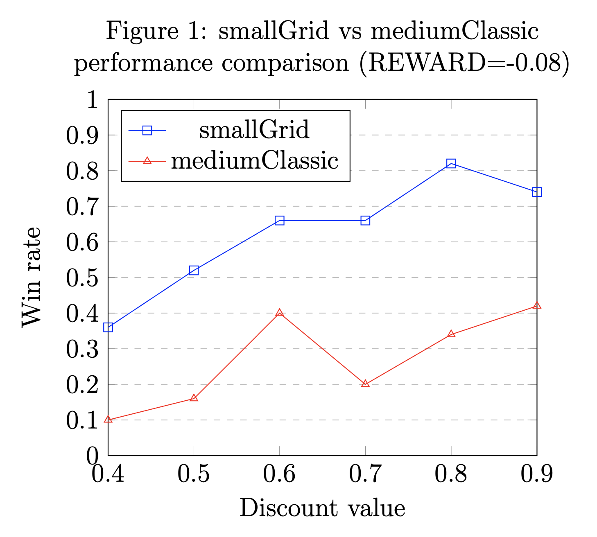

# MDP-Solver (Pacman with ghosts)

[Michael Sjoeberg](mailto:random@michaelsjoberg.com)

**IMPORTANT: Pacman source code and complete solution code not included due to coursework distribution limitations (i.e. not allowed to make solutions public!).**

## Aims

The aims for this report are; to describe the implementation of a MDP-solver used to control Pacman, to win at least four games in ``smallGrid`` and at least two games in ``mediumClassic``; and to evaluate its performance.

## Implementation

### Limitations

- only use Python 2.7 (and libraries part of the Python 2.7 distribution)
- only interact with the environment via ``api.py``
- only modify code in ``mdpAgents.py``
- only use MDP-solver to decide what to do

### Initial decisions

The utility values, ``utility_food:1``, ``utility_ghost:-1``, and ``empty:0``, are based on a value iteration model for ``smallGrid`` (created in Excel and **not included**). The model was used to experiment with different utility values, discount value and reward (decided on ``DISCOUNT_VALUE=0.9`` and ``REWARD=-0.08``), and to understand how different values affected the value iteration outcome. 

Alternative and additional utility values for food and ghost in direction (of Pacman) was briefly explored, such as ``10`` and ``-10``, with the idea to make Pacman more likely to move towards food, or away from ghost, in same direction. This approach worked well on ``smallGrid``, which has fewer states with food, but not so well on ``mediumClassic`` (or no significant difference!).

The MDP-solver variation used in the implementation is value iteration, and the maximum- and average expected utility calculations are based on the deterministic approximation to the non-deterministic motion model (not accounting for probability that Pacman could move in wrong direction). The decision to use value iteration and the deterministic approximation was mainly due to ease of implementation based on model already created in Excel.

To calculate expected utility values in future states, as part of the MDP-solver:

- **maximum expected utility** would result in the same expected utility for states next to a state with, or without, ghost (the negative utility from ghosts are ignored due to always selecting maximum utility)

- **average expected utility** would result in lower expected utility for states next to a state with ghost (the negative utility from ghosts are included due to taking the average)

A lower expected utility for states next to a state with ghost would make Pacman more likely to move towards another state (and preferably away from ghost!), so decided to use average expected utility.

### Creating the map

The initial state of the map is created using ``api.py``, and based on the location of ``corners``, ``walls``, ``foods``, and ``ghosts``:

- The location of each corner in ``corners`` is used to generate a map of empty states between all four corners, and location of each wall in ``walls`` is deleted from map (not available as a state).

- The location of each food in ``foods`` and each ghost in ``ghosts`` are added to map with their corresponding utility values, ``utility_food:1`` and ``utility_ghost:-1``.

To make Pacman more likely to move towards food in state without surrounding walls (i.e. to avoid getting trapped in dead end on ``smallGrid``); update the initial state of the map to use same utility value as empty state for food in states with surrounding walls until state is the only state with food left in map.

```
# find all states with food
food_in_map = [location for location in self.map['states'].keys() if self.map['states'][location]['food'] == True]
for food in food_in_map:
    # unless last food in map
    if (len(food_in_map) > 1):
        next_state_walls = []
        for move in self.moves.keys():
            transition = self.moves[move]

            # define next_state
            next_state = (food[0] + transition[0], food[1] + transition[1])

            if (next_state not in self.map['states']): 
                next_state_walls.append(True)
            else:
                next_state_walls.append(False)

            # hide food in state that is dead end
            if (next_state_walls.count(True) == 3):
                self.map['states'][food]['food'] = False
                self.map['states'][food]['utility'] = 0
```

To make Pacman more likely to move away from states close to ghosts; update the initial state of the map to use same utility value as state with ghost for any state in a *N*-step radius, basically lower initial utility values around states with ghost as a "padding". The states close to ghosts are not treated as ghosts during value iteration, so expected utility value will be averaged, since a state close to ghost is still better than a state with ghost.

```
def set_ghost_padding(self, location, N, N_MAX=10):
    '''Function to recursively add padding to states near ghost.'''

    # sanity check
    if (N < N_MAX):
        for move in self.moves.keys():
            transition = self.moves[move]

            # define next location
            next_location = (location[0] + transition[0], location[1] + transition[1])

            # next_location in available states (i.e. not a wall)
            if (next_location in self.map['states']):
                if (not self.map['states'][next_location]['ghost']):
                    # set utility in next_location
                    self.map['states'][next_location]['danger'] = True
                    self.map['states'][next_location]['utility'] = self.utility_ghost

            self.set_ghost_padding(next_location, N + 1, N_MAX)
```

To make Pacman more likely to move away from state with ghost, in one direction, but towards state close to ghost, in other direction; update the initial state of the map to use same utility value as empty state for state with Pacman (assuming Pacman either ate food in state, or died from ghost!). The state on one side of Pacman, opposite to ghost but within ghost padding, should still be preferred to state on same side as ghost.

### Value iteration

To solve the MDP using value iteration and the initial state of the map (with initial utility values assigned to each available state in map, as described in above:

- Set the discount value and reward, ``DISCOUNT_VALUE=0.9`` and ``REWARD=-0.08`` (see **Evaluation**)

- Copy the initial state of the map, or previous map in the following iterations, to its own map (using ``copy.deepcopy`` to avoid Python still referencing the previous map)

- The expected utility value for each state in the new map is calculated using the discount value, reward, and average expected utility for states around the corresponding location in the previous map

- The process of copying previous map and calculating expected utility values in new map is repeated until the resulting map is equal to the previous map (i.e. utility values do not change any more)

- The outcome is the final state of the map

The best move in any state is extracted directly from the final state of the map using maximum expected utility (this is the optimal policy).

## Evaluation

### Pacman performance in ``smallGrid``

Running ``python pacman.py -q -n 50 -p MDPAgent -l smallGrid`` with ``REWARD=-0.04``:

| ``DISCOUNT_VALUE`` | ``REWARD`` | Win rate         |
| ------------------ | ---------- | ---------------- |
| 0.9                | -0.04      | 36/50 (0.72)     |
| **0.8**            | **-0.04**  | **37/50 (0.74)** |
| 0.7                | -0.04      | 34/50 (0.68)     |
| 0.6                | -0.04      | 34/50 (0.68)     |
| 0.5                | -0.04      | 21/50 (0.42)     |
| 0.4                | -0.04      | 19/50 (0.38)     |

Running ``python pacman.py -q -n 50 -p MDPAgent -l smallGrid`` with ``DISCOUNT_VALUE=-0.08``:

| ``DISCOUNT_VALUE`` | ``REWARD`` | Win rate         |
| ------------------ | ---------- | ---------------- |
| 0.8                | -0.02      | 37/50 (0.74)     |
| 0.8                | -0.04      | 37/50 (0.74)     |
| 0.8                | -0.06      | 36/50 (0.72)     |
| **0.8**            | **-0.08**  | **41/50 (0.82)** |
| 0.8                | -0.10      | 38/50 (0.76)     |
| 0.8                | -0.12      | 33/50 (0.66)     |

Running ``python pacman.py -q -n 50 -p MDPAgent -l smallGrid`` with ``REWARD=-0.08``:

| ``DISCOUNT_VALUE`` | ``REWARD`` | Win rate         |
| ------------------ | ---------- | ---------------- |
| 0.9                | -0.08      | 37/50 (0.74)     |
| **0.8**            | **-0.08**  | **41/50 (0.82)** |
| 0.7                | -0.08      | 33/50 (0.66)     |
| 0.6                | -0.08      | 33/50 (0.66)     |
| 0.5                | -0.08      | 26/50 (0.52)     |
| 0.4                | -0.08      | 18/50 (0.36)     |

The above experiments show ``DISCOUNT_VALUE={0.8,0.9}`` and ``REWARD={-0.02,-0.04,-0.08,-0.10}`` are the best performing discount values and rewards in ``smallGrid``, using any combination of the two would likely produce results that are acceptable based on the aims for this report.

### Pacman performance in ``mediumClassic``

Running ``python pacman.py -q -n 50 -p MDPAgent -l mediumClassic`` with ``REWARD=-0.04``:

| ``DISCOUNT_VALUE`` | ``REWARD`` | Win rate         |
| ------------------ | ---------- | ---------------- |
| **0.9**            | **-0.04**  | **18/50 (0.36)** |
| 0.8                | -0.04      | 17/50 (0.34)     |
| 0.7                | -0.04      | 15/50 (0.30)     |
| **0.6**            | **-0.04**  | **18/50 (0.36)** |
| 0.5                | -0.04      | 12/50 (0.24)     |
| 0.4                | -0.04      | 1/50 (0.02)      |

Running ``python pacman.py -q -n 50 -p MDPAgent -l mediumClassic`` with ``DISCOUNT_VALUE=0.9``:

| ``DISCOUNT_VALUE`` | ``REWARD`` | Win rate         |
| ------------------ | ---------- | ---------------- |
| 0.9                | -0.02      | 18/50 (0.36)     |
| 0.9                | -0.04      | 21/50 (0.42)     |
| 0.9                | -0.06      | 20/50 (0.40)     |
| **0.9**            | **-0.08**  | **22/50 (0.44)** |
| 0.9                | -0.10      | 18/50 (0.36)     |
| 0.9                | -0.12      | 7/50 (0.14)      |

Running ``python pacman.py -q -n 50 -p MDPAgent -l mediumClassic`` with ``REWARD=-0.08``:

| ``DISCOUNT_VALUE`` | ``REWARD`` | Win rate         |
| ------------------ | ---------- | ---------------- |
| **0.9**            | **-0.08**  | **21/50 (0.42)** |
| 0.8                | -0.08      | 17/50 (0.34)     |
| 0.7                | -0.08      | 10/50 (0.20)     |
| 0.6                | -0.08      | 20/50 (0.40)     |
| 0.5                | -0.08      | 8/50 (0.16)      |
| 0.4                | -0.08      | 5/50 (0.10)      |

The above experiments show ``DISCOUNT_VALUE={0.6,0.8,0.9}`` and ``REWARD={-0.04,-0.06,-0.08}`` are the best performing discount values and rewards in ``mediumClassic``, using any combination of the two would likely produce results that are acceptable based on the aims for this report.

### Appendix A: Figure 1

